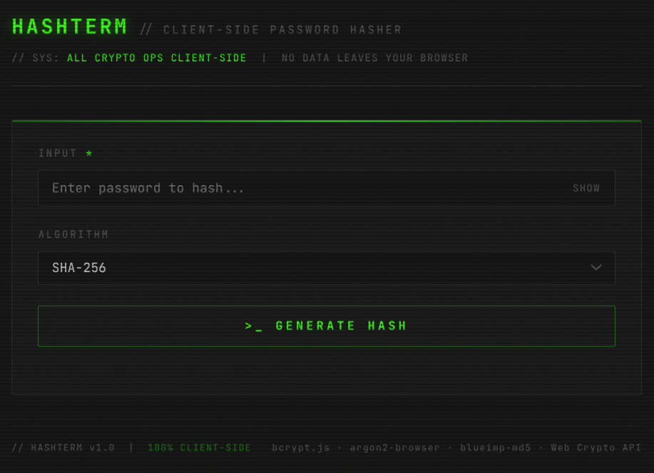

# HASHTERM // Password Hasher

*A client-side password hashing utility designed to simplify generating secure password hashes for Docker containers and other applications requiring pre-hashed credentials.*

---

 <!-- Preview would show in actual README -->

---
## Overview

HASHTERM is a standalone HTML/JavaScript tool that enables secure password hashing entirely within the browser. No data ever leaves your machine, making it ideal for generating sensitive credentials like Docker container passwords, API keys, or any application requiring pre-computed hashes.

Built with modern web cryptography APIs and trusted libraries (bcrypt.js, argon2-browser, blueimp-md5), it provides a simple interface for generating hashes using industry-standard algorithms.

## Features

- **100% Client-Side**: All cryptographic operations occur in your browser - zero data transmission
- **Multiple Algorithms**: Support for bcrypt, argon2id, SHA-256, SHA-512, and MD5 (legacy only)
- **Configurable Parameters**: Adjust algorithm-specific settings like cost factors, memory, iterations, and parallelism
- **Real-Time Timing**: See exactly how long each hash computation takes
- **Copy to Clipboard**: One-click copying of generated hashes
- **Secure Input**: Password field with show/hide toggle and autocomplete prevention
- **Error Handling**: Clear feedback for invalid inputs or computation errors
- **Responsive Design**: Works on desktop and mobile browsers
- **Dark Terminal Aesthetic**: JetBrains Mono font with cyberpunk-inspired UI

## Supported Algorithms

| Algorithm | Description | Security Level | Configurable Options |
|-----------|-------------|----------------|----------------------|
| **bcrypt** | Adaptive hash function designed for password hashing | High | Cost factor (rounds: 8-14) |
| **argon2id** | Modern memory-hard algorithm (recommended for Docker) | Highest | Memory (KiB), iterations, parallelism |
| **SHA-256** | Cryptographic hash function (Web Crypto API) | Moderate* | None |
| **SHA-512** | Cryptographic hash function (Web Crypto API) | Moderate* | None |
| **MD5** | Legacy hash function (included for compatibility only) | ⚠ Broken | None |

> \* SHA-2/SHA-512 are not recommended for password storage without additional work factors (like PBKDF2). Use bcrypt or argon2id for password hashing.

## How to Use

1. **Open the Tool**: Simply open `pw-hasher.html` in any modern web browser
2. **Enter Password**: Type your password in the "Input" field
3. **Select Algorithm**: Choose from the dropdown menu
4. **Configure Options** (if applicable):
   - For **bcrypt**: Adjust the "Cost Factor" slider (higher = more secure but slower)
   - For **argon2id**: Set Memory (KiB), Iterations, and Parallelism values
5. **Generate Hash**: Click the ">_ GENERATE HASH" button
6. **Copy Result**: Click ">_ COPY TO CLIPBOARD" to copy the hash for use in your Dockerfile or application

## Example Usage for Docker

When creating Docker containers that require pre-hashed passwords (common with databases like PostgreSQL, MySQL, or custom applications):

1. Generate an argon2id hash using HASHTERM with recommended settings:
   - Memory: 65536 KiB (64 MiB)
   - Iterations: 3
   - Parallelism: 1
2. Copy the resulting hash
3. Use it in your Docker environment:
   ```dockerfile
   # Example for PostgreSQL
   ENV POSTGRES_PASSWORD_HASH=$argon2id$v=19$m=65536,t=3,p=1$...
   ```
   Or in application configuration files requiring pre-hashed credentials.

## Technical Details

### Libraries Used
- [bcrypt.js](https://github.com/kelektiv/node.bcrypt.js) - For bcrypt hashing
- [argon2-browser](https://github.com/ranisalt/node-argon2/wiki/WebAssembly) - For argon2id hashing (WebAssembly)
- [blueimp-md5](https://github.com/blueimp/JavaScript-MD5) - For MD5 hashing (legacy compatibility)
- [Web Crypto API](https://developer.mozilla.org/en-US/docs/Web/API/Web_Crypto_API) - For SHA-256 and SHA-512 (native browser implementation)

### Security Notes
- **All processing is client-side**: Your password never leaves your browser
- **No external tracking**: No analytics, no cookies, no third-party requests (except for loading the libraries from CDNs on initial load)
- **Open source**: Inspect the source code anytime to verify security claims
- **MD5 Warning**: The MD5 option is explicitly labeled as insecure and should only be used for legacy compatibility purposes

### Browser Compatibility
Works in all modern browsers that support:
- Web Crypto API (SHA-256/SHA-512)
- ES6 JavaScript features
- Clipboard API (with fallback to document.execCommand)

Tested in:
- Chrome 64+
- Firefox 60+
- Safari 12+
- Edge 79+

## Local Usage

No installation required. Simply:
1. Download or clone this repository
2. Open `pw-hasher.html` in your browser
3. Use immediately

For offline use, the tool works completely offline after the initial page load (libraries are cached by the browser).

## Development

To modify or extend the tool:
1. Edit `pw-hasher.html` directly - it's a single self-contained file
2. The JavaScript is contained in a single `<script>` tag at the bottom
3. CSS is in the `<style>` section for easy modification
4. To update libraries, change the CDN URLs in the `<head>` section

## Why Client-Side?

Server-based hash generators pose a security risk:
- Your password could be logged or intercepted
- You must trust the server operator
- Network transmission adds attack surface

HASHTERM eliminates these risks by performing all operations locally in your browser's secure sandbox.

## License

This tool is provided as-is for educational and utility purposes. Feel free to use, modify, and distribute it for your own needs.

## Acknowledgments

- Built with [bcrypt.js](https://github.com/kelektiv/node.bcrypt.js)
- Powered by [argon2-browser](https://github.com/ranisalt/node-argon2/wiki/WebAssembly)
- MD5 implementation via [blueimp-md5](https://github.com/blueimp/JavaScript-MD5)
- Inspired by the need for secure, offline password hashing tools in DevOps workflows

---
*Hashtterm v1.0 - Secure password hashing for the privacy-conscious developer*